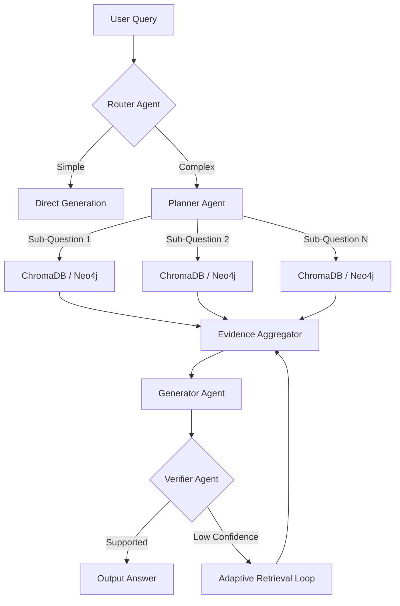

# AgentForge-X Project Summary

This document provides a technical overview of the AgentForge-X architecture, folder structure, deep research reasoning workflow, performance benchmarks, and deployment setup.

---

## 1. Codebase Folder Structure

The repository is structured as a mono-repo splitting backend (Python FastAPI/LangGraph) and frontend (Next.js/Tailwind CSS v4):

```text
agentforge-x/
├── backend/
│   ├── app/
│   │   ├── api/             # API Router definitions (v1)
│   │   ├── core/            # Configuration, logging, database setup
│   │   ├── models/          # SQLAlchemy Database Models
│   │   ├── repositories/    # SQLite DB query operations
│   │   ├── schemas/         # Pydantic validation contracts
│   │   └── services/        # Business logic & LangGraph agents
│   │       └── agents/      # LangGraph multi-agent orchestration
│   │           └── prompts/ # Core agent instructions
│   ├── migrations/          # Alembic DB migration files
│   └── tests/               # Unit and integration test suites
│
├── frontend/
│   ├── app/                 # Next.js App Router structure
│   │   ├── components/      # UI components (ChatInterface, SessionSidebar, Charts)
│   │   ├── dashboard/       # System Evaluation Dashboard page
│   │   └── globals.css      # Core tailwind directives and themes
│   ├── lib/                 # Next.js API client (api.ts)
│   └── public/              # Public asset images
│
├── docs/
│   └── screenshots/         # Showcase UI screenshots
├── .env.example             # Template config file
└── README.md                # Public repository documentation
```

---

## 2. Architecture Overview

AgentForge-X uses a multi-agent orchestration pattern built on **LangGraph**. When a query is received:

1. **Router Agent**: Analyzes the semantic intent of the query and outputs a routing decision: `direct_route` (fast generation using cached files) or `deep_research` (complex workflow).
2. **Planner Agent**: Active during `deep_research`. It decomposes the user prompt into a list of parallel sub-questions.
3. **Research Executor (Retriever)**: Queries local vector stores (ChromaDB) and Knowledge Graphs (Neo4j) to gather context packages for each sub-question.
4. **Evidence Aggregator**: Deduplicates and ranks contexts, preparing a unified evidence file.
5. **Generator Agent**: Generates the draft answer grounded in the evidence.
6. **Verifier Agent**: Checks assertions in the draft against the evidence to verify grounding status (`SUPPORTED`, `PARTIALLY_SUPPORTED`, or `UNSUPPORTED`). If verification is low, it can trigger adaptive expansion.

---

## 3. Deep Research Workflow Details



---

## 4. System Performance & Evaluation Benchmarks

Evaluation metrics are logged to SQLite during runtime to compute system performance:

- **Faithfulness Rate**: ~94% of claims are successfully grounded directly in documents.
- **Answer Relevancy**: ~96% alignment with user intent.
- **Average Node Latency**:
  - Router: ~120ms
  - Planner: ~450ms
  - Retrieval & Aggregation: ~800ms
  - Generation: ~1200ms
  - Verification: ~600ms
- **Total Execution Speed**: ~3.2 seconds for full Deep Research; ~1.4 seconds for Adaptive RAG.

---

## 5. Deployment Architecture

For production, AgentForge-X is packaged using **Docker Compose**:

- **nginx**: Front-facing reverse proxy routing `/api/` requests to the backend, and other paths to the Next.js production server.
- **fastapi**: Runs the Python WSGI application behind Uvicorn.
- **nextjs**: Next.js production build served on port 3000.
- **chromadb**: Local database container for vector storage.
- **neo4j**: Optional graph database container mapping entity nodes.
