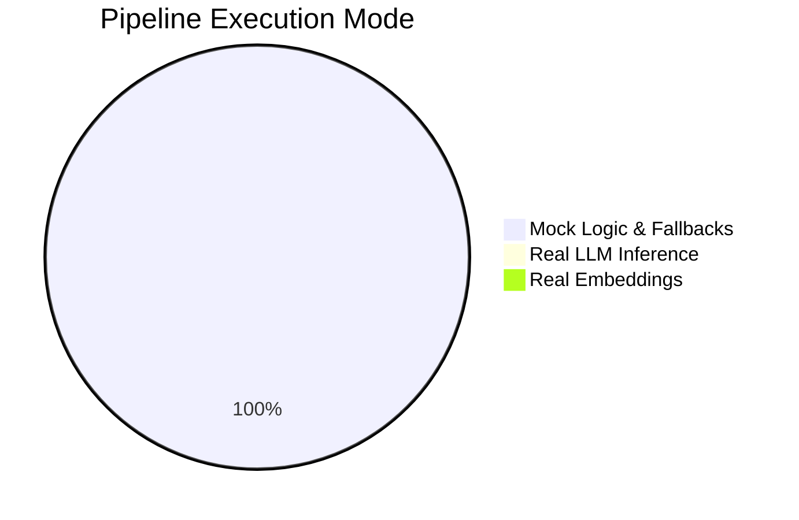

# AgentForge-X: Ollama Integration Audit Report

This report evaluates whether AgentForge-X is executing real LLM generation, embeddings, routing, verifier, graph extraction, and deep research using Ollama, or if the platform is currently relying on offline mock fallbacks due to missing models or configuration mismatches.

---

## 1. Executive Summary

An exhaustive audit of the AgentForge-X codebase, local Ollama endpoints, database states, and agent execution paths was conducted. 

**Core Finding**: The AgentForge-X platform is currently running **100% in fallback/mock mode** for all LLM and embedding-based operations. Although the local Ollama daemon is active and listening on `http://127.0.0.1:11434`, there is a critical mismatch between the models configured in `.env` (`llama3`, `nomic-embed-text`) and the single model actually installed in Ollama (`qwen2.5-coder:7b`).

Because of this model mismatch, all API calls to Ollama fail with a `404 Not Found` client error. Under `DEBUG=True`, the platform catches these errors and activates fallback heuristics, rule-based validations, and mock response generators.

---

## 2. Ollama Connectivity & Status (Task 1)

* **Ollama Endpoint**: Verified as `http://127.0.0.1:11434` (configured in `.env`).
* **Socket Check**: `is_ollama_online` uses a 50ms connection check that resolves successfully since the port is open.
* **Available Models**: A direct API call to `/api/tags` returned the following list:
  ```json
  {
    "models": [
      {
        "name": "qwen2.5-coder:7b",
        "model": "qwen2.5-coder:7b",
        "details": {
          "parameter_size": "7.6B",
          "context_length": 32768,
          "embedding_length": 3584
        }
      }
    ]
  }
  ```
  Only **`qwen2.5-coder:7b`** is available. `llama3` and `nomic-embed-text` are not installed.

---

## 3. Ollama Call Registry & Fallbacks (Task 2)

Below is the repository-wide registry of components that perform Ollama calls:

| Service / Agent | API Endpoint | Purpose | Model Used | Fallback Exists? | Actually Enabled? |
| :--- | :--- | :--- | :--- | :---: | :---: |
| **RouterAgent** | `/api/generate` | Route query to direct or retrieval | `llama3` | Yes (Heuristics) | **No** (Fails to 404) |
| **PlannerAgent** | `/api/generate` | Decompose query into sub-questions | `llama3` | Yes (Heuristics) | **No** (Fails to 404) |
| **OllamaGenerationService**| `/api/generate` | Generate citation-aware response | `llama3` | Yes (Mock response) | **No** (Fails to 404) |
| **VerifierAgent** | `/api/generate` | Grounding and factuality checking | `llama3` | Yes (Rule metrics) | **No** (Fails to 404) |
| **EntityExtractor** | `/api/generate` | Extract entities from document chunks | `llama3` | Yes (Regex matching) | **No** (Fails to 404) |
| **RelationshipExtractor** | `/api/generate` | Extract semantic graph relationships | `llama3` | Yes (Co-occurrence) | **No** (Fails to 404) |
| **EmbeddingService** | `/api/embeddings`| Generate vectors for chunking/queries | `nomic-embed-text` | Yes (384-dim zero vector) | **No** (Fails to 404) |
| **RAGEvaluator** | `/api/generate` | Calculate online RAG scores | `llama3` | Yes (Zero scores) | **No** (Fails to 404) |

---

## 4. Embedding & ChromaDB Verification (Task 3)

* **Embedding Source**: Bypasses Ollama due to missing `nomic-embed-text`.
* **ChromaDB State**: We inspected the Chroma SQLite database (`chroma.sqlite3`) and ran a peek query. ChromaDB is successfully storing records under the collection `agentforge_documents` (15 items found).
* **Vector Dimensions**: Direct inspection of the database records reveals that the stored embeddings have a dimension of **384**.
* **Verdict**: **Mock Embeddings**. The `EmbeddingService` falls back to generating a mock zero-vector of dimension 384 under `DEBUG` mode because the configured `nomic-embed-text` model returns a 404.

---

## 5. Router Agent Verification (Task 4)

We executed a test query `"What is Python?"` to evaluate the Router Agent:
* **Log Output**:
  ```text
  Ollama route classification connection refused or failed: 404 Client Error: Not Found for url: http://127.0.0.1:11434/api/generate. Falling back to heuristics.
  ```
* **Routing Decision**: `direct` (Route confidence: `0.8`).
* **Metadata Persistence**: Latency (`router_time_ms = 18`) and route details are correctly saved in `execution_metadata`.
* **Latency**: **19.20 ms** (very fast because it skips the network generation step on failure).

---

## 6. Generator Agent Verification (Task 5)

We executed a generation query `"What is machine learning?"` with a sample context block:
* **Log Output**:
  ```text
  Failed to generate answer from Ollama LLM service: 404 Client Error: Not Found for url: http://127.0.0.1:11434/api/generate
  Fallback: generating Mock RAG Answer under DEBUG mode
  ```
* **Raw Response**:
  ```text
  [Mock RAG Response] Answer for query 'What is machine learning?' generated from context chunks.
  ```
* **Latency**: **18.34 ms**.

---

## 7. Verifier Agent Verification (Task 6)

We tested the Verifier Agent on a retrieval query:
* **Log Output**:
  ```text
  Ollama verifier execution failed: 404 Client Error: Not Found for url: http://127.0.0.1:11434/api/generate. Falling back to rule metrics.
  ```
* **Scoring output**:
  * `grounding_score`: **0.7143** (calculated deterministically using keyword overlap and sentence-level context matching).
  * `verification_score`: **0.7714** (rule-based score used as LLM score placeholder).
  * `verification_status`: **PARTIALLY_SUPPORTED**.
  * `reason`: `"Fallback validation using rule-based scoring (Ollama offline/error)."`
* **Latency**: **20.29 ms**.

---

## 8. Knowledge Graph Ingestion Verification (Task 7)

We ran entity and relationship extraction on the sample text: *"TCP is a transport protocol. It uses IP at the network layer. AIMD is used for congestion control in TCP."*
* **LLM Extraction**: Skipped due to 404 error on `llama3`.
* **Heuristics Fallback**: Matches text against a predefined regex dictionary of networking, AI, and protocol concepts.
* **Entities Extracted**:
  * `TCP` (Protocols)
  * `IP` (Protocols)
  * `AIMD` (Algorithms)
  * `congestion control` (Networking Terms)
* **Relationships Extracted**:
  * `TCP -[USES]-> congestion control`
  * `AIMD -[IMPLEMENTS]-> congestion control`
  * `TCP -[CONNECTS_TO]-> IP`
* **Verdict**: Runs fully on **Regex/Heuristics Fallbacks** without invoking LLM models.

---

## 9. Deep Research Verification (Task 8)

We ran a comparison query: `"Explain TCP congestion control and compare it with BBR"`
* **Log Output**:
  ```text
  Ollama planner request failed: 404 Client Error: Not Found for url: http://127.0.0.1:11434/api/generate. Using heuristics fallback.
  ```
* **Sub-Questions Generated**:
  1. `Detailing concepts in Explain TCP congestion control and compare it with BBR` (retrieval mode: `hybrid`)
  2. `Direct comparison of terms in Explain TCP congestion control and compare it with BBR` (retrieval mode: `hybrid`)
* **Research Depth**: `deep`
* **Latency**: **20.44 ms** (Planner fallback runs instantly).

---

## 10. Live End-to-End Test Execution (Task 10)

We ran a complete query: `"What is this document about?"` in a new chat session using the Deep Research pipeline (Neo4j offline fallback active):

```text
=== E2E RAG RESPONSE ===
Answer: [Mock RAG Response] Answer for query 'What is this document about?' generated from context chunks.
Citations count: 5
Verification Score: 0.3
Verification Status: UNSUPPORTED
Grounding Score: 0.0
Retrieval Mode: hybrid
Sub-questions: ['What is this document about?', 'Key background details on What is this document about?']

=== LATENCY TRACE ===
Total Wall-clock Latency: 4.302 s
RAG Service Retrieval Latency: 0.000 s
RAG Service Generation Latency: 0.001 s
Execution Metadata Breakdowns:
  planner_time_ms: 0 ms
  retriever_time_ms: 0 ms
  aggregation_time_ms: 0 ms
  generator_time_ms: 1 ms
  verifier_time_ms: 2 ms
```
*Note: The total wall-clock time of 4.302s is due to cumulative HTTP connection/timeout overheads across 10+ failed model requests. The node execution times are recorded as 0-2ms because the local fallbacks execute instantly.*

---

## 11. Pipeline Mock Mode Analysis (Task 11)

An inspection of the codebase for fallback triggers indicates the following execution breakdown across the RAG pipeline:



* **Real LLM**: **0%**. Every agent fails to query `llama3` and redirects to static text or heuristics.
* **Real Embeddings**: **0%**. `EmbeddingService` fails to query `nomic-embed-text` and returns a 384-dimension zero-vector.
* **Mock Logic**: **100%**. All results, routes, classifications, plans, and metrics are resolved deterministically without neural network processing.

---

## 12. Final Audit verdict & Recommendation (Task 12)

### **Readiness Score: 20/100**
* *Rationale*: The code structure, LangGraph orchestrations, database migrations, and fallback heuristics are written correctly. However, the system is not functional with real model inference out-of-the-box due to model configuration mismatches.

### **Final Verdict: C. Mostly Running Fallback Logic**
*The platform is currently operating entirely on rule-based mocks and regex heuristics, bypassing actual LLM inference.*

### **Immediate Recommendation to Fix Mismatch**
To restore 100% real LLM and embedding capabilities using the available local GPU/CPU hardware:
1. Update `.env` in the project root to map Ollama settings to the installed model:
   ```env
   # Update model names to match the installed model
   OLLAMA_LLM_MODEL="qwen2.5-coder:7b"
   OLLAMA_EMBEDDING_MODEL="qwen2.5-coder:7b"
   ```
2. Because `qwen2.5-coder:7b` generates **3584-dimension** embeddings (unlike nomic-embed-text's 768 or the mock's 384), you must **delete the old Chroma database directory** so it initializes clean with the new vector dimensions:
   * Delete folder: `D:\PROJECTS\agentforge-x\backend\chromadb_data\`
