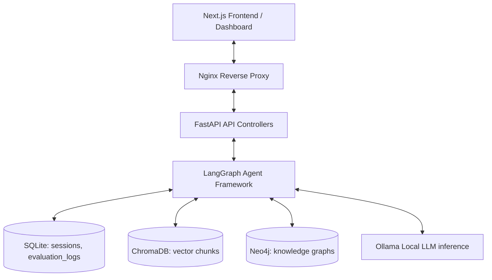
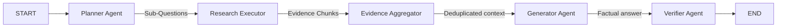

# Walkthrough: AgentForge-X Phase 9 (Production Deployment & Research Package)

Phase 9 transforms AgentForge-X into a production-deployable, academically reproducible research and portfolio showcase project.

---

## 🏗️ 1. Full Architecture Overview

AgentForge-X separates concerns into modular components using clean architecture:



---

## 🤖 2. LangGraph Workflow Diagrams

### A. Deep Research Workflow
Executes query planning, sub-question extraction, and aggregated evidence-aware generation:
`START` -> `Planner Agent` -> `Research Executor` -> `Evidence Aggregator` -> `Generator` -> `Verifier` -> `END`



### B. Knowledge Graph Workflow
Ingests files to map page hierarchy and extracts semantic relationships:
`(Document)-[:HAS_PAGE]->(Page)-[:HAS_CHUNK]->(Chunk)-[:MENTIONS]->(Entity)`

---

## 📈 3. Monitoring & Deployment Architecture

### A. Monitoring Setup
- **ASGI Middleware**: Records HTTP request counts, status codes, and execution latencies.
- **Metrics Registry**: In-memory registry for web traffic coupled with sqlite query records.
- **Endpoints**:
  - `/monitoring/health`: Returns basic health status.
  - `/monitoring/liveness`: Checks process availability.
  - `/monitoring/readiness`: Queries health checks for SQLite, ChromaDB, Neo4j, and Ollama.
  - `/monitoring/metrics`: Outputs JSON registry summaries.

### B. Deployment Package
- **Nginx Config**: reverse proxies `/api` to FastAPI and `/` to Next.js. Adds security headers (CSP, X-Frame-Options) and enables gzip compression.
- **Docker Compose Prod**: Fully containerized stack using healthcheck metrics for self-healing.

---

## 📦 4. Backup & Restore Procedures

Backup scripts are located in `backend/scripts/backups/`:

### A. SQLite Backup
- **Backup**: Copies the active SQLite database to `backups/sqlite/agentforge_backup_YYYYMMDD_HHMMSS.db`.
  ```bash
  python scripts/backups/backup_sqlite.py
  ```
- **Restore**: Stop the app, rename backup file to `agentforge.db`, and place in workspace database folder.

### B. ChromaDB Backup
- **Backup**: Packs the persistent ChromaDB folder into a timestamped zip in `backups/chromadb/`.
  ```bash
  python scripts/backups/backup_chromadb.py
  ```
- **Restore**: Stop ChromaDB, extract the zip file inside the persistent folder, and restart.

### C. Neo4j Backup
- **Backup**: Connects to the Neo4j instance and generates a complete Cypher script file containing MERGE statements for all nodes and relationships under `backups/neo4j/`.
  ```bash
  python scripts/backups/backup_neo4j.py
  ```
- **Restore**: Run the Cypher statements inside `cypher-shell`:
  ```bash
  cypher-shell -u neo4j -p password -f backups/neo4j/backup_name.cypher
  ```

---

## 🧪 5. Experiment & Ablation Methodology

Our evaluation framework ensures mathematical reproducibility:

### A. Experiment Runner (`research/experiment_runner.py`)
- Evaluates 100 queries for each of the 4 configurations (Vector, Graph, Hybrid, Deep Research).
- Exports metrics to CSV, JSON, and Markdown summaries under `research/results/`.
- Run command:
  ```bash
  python research/experiment_runner.py --limit 100
  ```

### B. Ablation Study (`research/ablation_study.py`)
- Ablates key subsystems (Verifier, Adaptive Retrieval, Knowledge Graph, Planner) to assess contribution scores.
- Exports summaries to `research/results/ablation_report.md`.
- Run command:
  ```bash
  python research/ablation_study.py --limit 10
  ```

### C. Paper Generator (`research/generate_paper.py`)
- Dynamically reads the results from `research/results/` and compiles Scopus-style paper segments and `paper.md` under `research/paper/`.
- Run command:
  ```bash
  python research/generate_paper.py
  ```

---

## 🪐 6. Gemini API Migration (CPU-Only Optimized)

To resolve execution timeouts on CPU-only local environments (e.g. Intel Core i3 without discrete GPU), the reasoning components have been migrated to the Gemini API (`gemini-2.5-flash`), while leaving vector database indexes, Nomics embeddings, and graph databases running locally.

### A. Backend Provider Integration
- Configured dynamically via `LLM_PROVIDER=gemini` and `GEMINI_API_KEY` in `backend/.env`.
- Integrates Google Generative AI SDK, enforcing JSON schema mode for the Planner, Verifier, and Graph extraction engines.
- Health status is exposed on `/api/v1/monitoring/gemini` and checked in `/readiness`.

### B. Next.js Chat Workspace
- Replaced basic landing page with a unified three-column workspace layout.
- Integrates the session sidebar, document upload utility, live agent reasoning timeline visualizations, citations list, and confidence scores panels.

